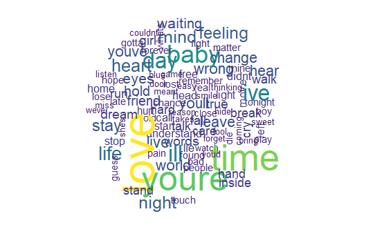

# Applied Data Science @ Columbia
## Spring 2020
## Project 1: A "data story" on the songs of our times



### [Project Description](doc/)
This is the first and only *individual* (as opposed to *team*) this semester. 

Term: Spring 2020

+ Projec title: Repetitive and Meaningless Song Lyrics
+ This project is conducted by Wenjun Yang (wy2347)
+ Github: (https://github.com/TZstatsADS/Spring2020-Project1-Morgan-Yang)

+ Project summary: This project is developed from the idea of repetitive and meaningless song lyrics and intended to dig more about them. Based on the provided dataset, methods/tools like wordcloud, heatmap and sentiment analysis are used to answer several interesting question like "Who is the artist with the least sophiscated lyrics?" and etc.

Following [suggestions](http://nicercode.github.io/blog/2013-04-05-projects/) by [RICH FITZJOHN](http://nicercode.github.io/about/#Team) (@richfitz). This folder is orgarnized as follows.

```
proj/
├── lib/
├── data/
├── doc/
├── figs/
└── output/
```

Please see each subfolder for a README file.
