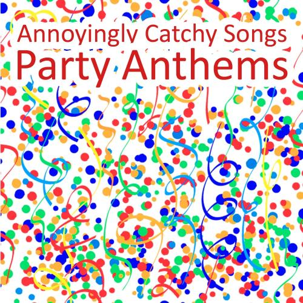

# Step 0: Goal and definition.
Have you ever wondered why do singers repeat the same lyric multiple times in a song? If you actually pay attention to the lyrics itself, sometimes you'll find it's really meaningless. But those songs are really catchy, though sometimes annoyingly catchy. Once you hear it, you just can't get them out of your head.

Here is an example of song with Repetitive and Meaningless Song Lyric.

A-well-a ev'rybody's heard about the bird

B-b-b-bird, b-birdd's a word

A-well, a bird, bird, bird, bird is a word

A-well, a bird, bird, bird, well-a bird is a word

A-well, a bird, bird, bird, b-bird's a word

A-well, a bird, bird, bird, well-a bird is a word

A-well, a bird, bird, b-bird is a word

A-well, a bird, bird, bird, b-bird's a word

A-well, a bird, bird, bird, well-a bird is a word

A-well, a bird, bird, b-bird's a word

A-well-a don't you know about the bird

Well, everybody knows that the bird is a word

[repeat]

[Surfin' Bird --- Trashman]

This programme is developed from the idea of repetitive and meaningless song lyrics and intended to dig more about questions like "Are song lyrics getting more repetitive or meaningless nowadays?", "Which genre tends to have more repetitive and meaningless lyrics", "Who is the artist with the least sophiscated lyrics?","What emotions do these songs mostly convey?".


# Step 1: check and install needed packages. Load the libraries and functions. 
```{r, message=FALSE, warning=FALSE}
packages.used=c("rvest", "tibble", "qdap", 
                "sentimentr", "gplots", "dplyr",
                "tm", "syuzhet", "factoextra", 
                "beeswarm", "scales", "RColorBrewer",
                "RANN", "tm", "topicmodels")

# check packages that need to be installed.
packages.needed=setdiff(packages.used, 
                        intersect(installed.packages()[,1], 
                                  packages.used))

# install additional packages
if(length(packages.needed)>0){
  install.packages(packages.needed, dependencies = TRUE)
}

# load packages
library("rvest")
library("tibble")

# You may need to run
# sudo ln -f -s $(/usr/libexec/java_home)/jre/lib/server/libjvm.dylib /usr/local/lib
# in order to load qdap
library("qdap")
library("sentimentr")
library("gplots")
library("dplyr")
library("tm")
library("syuzhet")
library("factoextra")
library("beeswarm")
library("scales")
library("RColorBrewer")
library("RANN")
library("tm")
library("topicmodels")
library("tidyr")
library("wordcloud")
library("DT")
library(data.table)
library(tidytext)
library(tidyverse)

```


# Step 2: Rate of distinct word against post-processed total word ---- Repeat Rate
First, counting distinct words and total words in each song. Then by $$repeat\,rate=1-\frac{distinct\,word}{total\,word}$$, the outcome shows the limited vocabulary and will be used to indicate the repeatness of song lyrics.The larger the repeat rate, the lyrics is more repetitive.

```{r, message=FALSE, warning=FALSE}
#load("../output/processed_lyrics.RData")
#postprocessed_df=dt_lyrics%>%
#  mutate(postprocess_count=word_count(stemmedwords))%>%
#  mutate(split_word=strsplit(stemmedwords," "),
#         distinct_count=sapply(split_word,n_distinct))%>%
#  mutate(keyword_repeat=1-distinct_count/postprocess_count)
#save(postprocessed_df, file="../output/postprocessed_df.RData")
load("../output/postprocessed_df.RData")
df1=postprocessed_df%>%
  filter(postprocess_count>40)%>%
  arrange(desc(keyword_repeat))
head(df1,100)
         
```
Above table shows the most repetitve 100 songs based on repeat rate. You can check the stemmedwords column to see that these songs on the top basiclly just repeat 2-3 words over and over again. Daft punk is the artist who have more songs with repetitive lyrics.


# Step 3: Rate of meaningless word and stop word aganinst pre-processed total word ---- Meaningless Rate
Having a bunch of meaningless words, pronouns or connective words can decrease the information density of a song. Though people don't expect to actually learn something through listening to music, songs like this still give people a tedious vibe.
So in this section, we start from counting distinct words and total words in the pre-processed file (processed_lyrics.Rdata without removing the stop words). Then by $$meaningless\,rate=1-\frac{distinct\,word}{total\,word}$$, the outcome shows the percentage of redundant words in the lyrics and will be used to indicate the meaninglessness of song lyrics.The larger the meaningless rate, the lyrics has less information density.

```{r,message=FALSE, warning=FALSE}
#load("../data/lyrics.RData")
#preprocessed_df=dt_lyrics
# function for removimg leading and trailing whitespace from character strings 
#leadingWhitespace <- content_transformer(function(x) str_trim(x, side = "both"))

# clean the data and make a corpus
#corpus <- VCorpus(VectorSource(dt_lyrics$lyrics))%>%
#  tm_map(content_transformer(tolower))%>%
#  tm_map(removePunctuation)%>%
#  tm_map(removeWords, character(0))%>%
#  tm_map(removeNumbers)%>%
#  tm_map(stripWhitespace)%>%
#  tm_map(leadingWhitespace)

#stemmed <- tm_map(corpus, stemDocument) %>%
#  tidy() 

#preprocessed_df=preprocessed_df%>%
#  mutate(preprocessed_word=stemmed$text)%>%
#  mutate(preprocess_count=word_count(preprocessed_word))
#save(preprocessed_df, file="../output/preprocessed_df.RData")
load("../output/preprocessed_df.RData")
df=postprocessed_df%>%
  left_join(preprocessed_df,c("song"="song","year"="year","artist"="artist","genre"="genre","lyrics"="lyrics"))%>%
  mutate(meaningless_rate=1-postprocess_count/preprocess_count)%>%
  select(song,year,artist,genre,lyrics,stemmedwords,keyword_repeat,meaningless_rate)

df_cheeky=df%>%
  filter(keyword_repeat>0.85 | meaningless_rate>0.85)
```

Based on repeat rate and meaningless rate (either one of the two over 85% will be considered a typical repetitive or meaningless song), we get the table above.

Now we have narrowed down our our song list to 1972 rows. Let's find out the trend and interesting facts about those annoyingly catchy songs!


# Step 4 Are song lyrics getting more repetitive or meaningless nowadays?

```{r, message=FALSE, warning=FALSE}
library(ggplot2)
ggplot(data=df)+
  geom_bar(mapping = aes(x=year))+
  xlim(1980,2020)+
  theme_light()


ggplot(data=df_cheeky)+
  geom_bar(mapping = aes(x=year))+
  xlim(1980,2020)+
  theme_light()
```

From the above two graph above, it's clear to see our data is limited, most of which is around year 2006. So to see if there is trend of increasing repetive and meaningless lyrics, we have to use the rate.

```{r,message=FALSE, warning=FALSE}
df_year=df%>%
  count(year,name="total")
rep_year=df_cheeky%>%
  count(year,name="rep_total")
year_rep_rate=rep_year%>%
  left_join(df_year,by="year")%>%
  mutate(rep_rate=rep_total/total)
ggplot(data=year_rep_rate)+
  geom_bar(mapping = aes(x=year,y=rep_rate),stat="identity")+
  xlim(1980,2016)+
  labs(title="Are song lyrics getting more repetitive or meaningless nowadays?")+
  theme_light()
```

Judging from the graph above, it seems there isn't a significant trend of growing number of repetitive lyrics. The rate of songs with repetitive lyrics has been relatively steady. In fact, if we change the condition of repetitiveness and meaninglessness to "keyword_repeat>0.7 | meaningless_rate>0.7", the rates become even more steady.


# Step 5 Which genre tends to be repetitive and meaningless?

```{r, message=FALSE, warning=FALSE}
ggplot(data=df_cheeky)+
  geom_bar(mapping = aes(x=genre))+
  labs(title="Which genre tends to be repetitive and meaningless?")+
  theme_light()
```

To people's surprise, Rock music genre has more meaningless and repetitive song lyrics than others.

# Step 6 Who is the artist with the least sophiscated lyrics?

```{r, message=FALSE, warning=FALSE}
top_10_cheeky=df_cheeky%>%
  count(artist)%>%
  arrange(desc(n))%>%
  mutate(artist=ordered(artist))%>%
  top_n(10)
top_10_cheeky
ggplot(data=top_10_cheeky)+
  geom_bar(aes(x=artist,y=n,fill=artist),stat="identity", width=1, color="white")+
  coord_polar("y", start=0)+
  labs(title="Who is the artist with the least sophiscated lyrics?")+
  theme_light()

```

This may irritate the fans, but based on our criteria, Canaidan singer Avril Lavgineand, French electronic music duo Daft Punk, and English Rock Band Beatles are the top 3 in the rank.


# Step 7 Most common words in those songs

Now which words are frequently seen in those songs?
First extract distinct words from each songs. Then we combine them together, and get the frequency of each words then sort them by descending order.
To make the result more clear, we will use wordcloud package.

```{r, message=FALSE, warning=FALSE}
df_wordcloud=df_cheeky%>%
  mutate(split_word=strsplit(stemmedwords," "))%>%
  mutate(distinct_word=sapply(split_word,unique))
cheeky_word=as.data.frame(table(unlist(df_wordcloud$distinct_word)))
cheeky_word=as_tibble(cheeky_word)
cheeky_word%>%
  arrange(desc(Freq))


library(viridis)
wordcloud(unlist(df_wordcloud$distinct_word),max.words =100,colors=palette(viridis(1000)))
```

For comparison, we give the wordcloud for all songs to see if there is any difference.

```{r, message=FALSE, warning=FALSE}
#all_wordcloud=postprocessed_df%>%
#  mutate(split_word=strsplit(stemmedwords," "))%>%
#  mutate(distinct_word=sapply(split_word,unique))
#save(all_wordcloud, file="../output/all_wordcloud.RData")
load("../output/all_wordcloud.RData")
all_word=as.data.frame(table(unlist(all_wordcloud$distinct_word)))
all_word=as_tibble(all_word)
all_word%>%
  arrange(desc(Freq))

wordcloud(unlist(all_wordcloud$distinct_word),max.words =100,colors=palette(viridis(1000)))

```

From above, We can see LOVE is undoubtedly the most common used words in song, regardless of repeatness and meaninglessness, because LOVE is what every one crave, right? Thus there is no big difference in the theme of this kind of songs and others, it's just the cheap repeat that differentiate them.


# Step 8 How do people feel when they are singing those song, namely what feelings do these songs convey? --- Sentiment Analysis
Since the songs with repetitive and meaningless lyris have very limited vocabulary, their sentiment should be very monotonous instead of complex. And this kind of songs often serve as a cheap thrill that cheers people up, so it's more likely to give positive feeling and upbeat emotion. Let's see if this is the truth.

```{r,message=FALSE, warning=FALSE}
#rep_emotions=as.matrix(get_nrc_sentiment(df_cheeky$stemmedwords))
#save(rep_emotions, file="../output/rep_emo.RData")
load("../output/rep_emo.RData")

#all_emotions=as.matrix(get_nrc_sentiment(df$stemmedwords))
#save(all_emotions, file="../output/all_emo.RData")
load("../output/all_emo.RData")

tb=rbind(colSums(rep_emotions),colSums(all_emotions))
tb=prop.table(tb,1)
rownames(tb)=c("target","all")
tb
```
From the above table, it seems songs with repetitive and meaningless lyrics show less anger, digust, trust, negative emotions, when compared with all songs in general. And at the same time, they show more anticipation, joy, surprise and positive emotions, which correspons with our speculation.


## Cluster the emotions:
```{r, fig.width=8, fig.height=8,message=FALSE, warning=FALSE}
heatmap.2(cor(as_tibble(rep_emotions)%>%select(anger:trust)), 
          scale = "none", 
          col = bluered(100), , margin=c(6, 6), key=F,
          trace = "none", density.info = "none")
```

We can see the 8 emotions in the target songs are roughly divided into 2 groups, that is group 1 (trust, joy, anticipation, surprise) and group 2 (fear, sadness, anger, disgust). This finding is mostly in line with our common sense. e.g. It's relatively more unlikey to see a song showing both fear and joy than showing both trust and joy. 


# Summary
By digging into the provided dataset, we can find many interesting and surprising things.

There is no significant trend of increasing number of repetitve and meaningless songs. In fact, they take up a very steady propotion of all songs.
And among all the genres, Rock is the biggise contributor to these songs. But as we all know there're many different subcategories under Rock, more specific conclusion can be reached with more detailed data. Canaidan singer Avril Lavgineand, followed by French electronic music duo Daft Punk, and English Rock Band Beatles, is on top of the rank of artist with the least sophiscated lyrics. Top 10 also includes Fatboy Slim, Dinosaur jr, Beach boys, Avicii, Dandy Warhols, Eiffel 65, Chemical Brothers and Face to Face. And love is the all-time common word in lyrics both in our target songs and in general. It's also noted that our target songs tend to give a more positive vibe than songs in general.

Nowadays, we are surrounded by these annoyingly catchy songs. Whenever you watch TV or turn on radio or randomly watch video on youtube or tiktok, there is a large chance you could encounter them. Around the World by Daft Punk may be a good representative of these songs: it repeats merely 3 words for 144 times. And many of Daft Punk's work share the same features: limited vocabulary and tedious repeatness.

But it's not to say these songs are inferior to the others. It has its own advangtages and selling points. People love them for they are easy to memorize; so everybody could sing them, or because they are so hilarious, everybody would like to share with friends; or maybe it's the tune and rhythm that the songs is focus on. Consequently, they somehow serve as the bridge between people and bring joy all over the world. And on the other hand, for the music producer, they all wnat their song to be a hit song. Since simple lyrics and catchy tune happen to be the common feature of many hit songs, no wonder they will try to produce music like these.

Besides all the things above, However, it's also important to note that the dataset itself is limited, for it lacks the most recent songs and many hit songs. And since many of the hit songs are featured with repeated and catchy chorus, this lack may significantly affect the results derived from the dataset.


# Some fun links:
+ [Are Pop Lyrics Getting More Repetitive? ](https://pudding.cool/2017/05/song-repetition/)
+ [Songs with a word or phrase repeated over and over](https://www.songfacts.com/category/songs-with-a-word-or-phrase-repeated-over-and-over)
+ [These 15 Songs Have The Most Repetitive Lyrics Of All Time All Time All Time All Timel](http://www.vh1.com/news/23764/the-15-most-repetitive-songs-of-all-time/)
